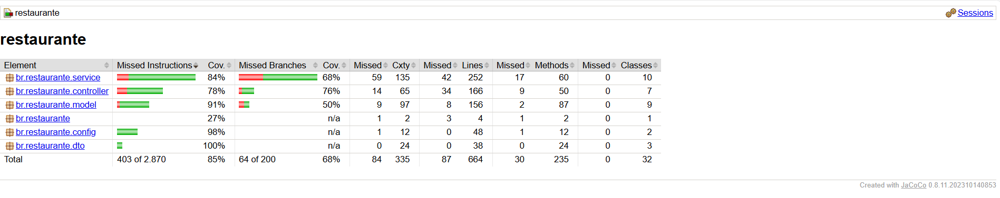

#  DOCUMENTAÇÃO PARA A AVALIAÇÃO DA P2 DA DISCIPLINA DSM

**Qualidade e Testes de Software**  
**Turma:** DSM - 6º Ciclo  
**Professor Orientador:** Alessandro Ferreira Paz Lima  

**Integrantes:**
- Ana Paula Velozo  
- Christyan Kawamura  
- Iago Corrêa de Lima  
- Leonardo Renner  
- Pérsio de Souza Lima  

---

##  1. Introdução

Este documento apresenta uma visão completa do processo de testes do backend do sistema **Saborê**, incluindo:

- Estrutura de testes (Service, Controller, Model)
- Estratégia adotada
- Cobertura obtida (JaCoCo)
- Defeitos corrigidos
- Justificativas técnicas (autenticação, mocks, arquitetura)
- Explicação sobre como os testes foram escritos e executados

**Objetivo:** demonstrar domínio técnico e clareza arquitetural.

---

##  2. Arquitetura geral do backend e onde entram os testes

A arquitetura segue o padrão REST com **Spring Boot**:

    Controller → Service → Repository → PostgreSQL
                      ↓
              Integrações (ViaCep)

**Como isso influencia os testes:**

- **Controllers:** testados com MockMvc (simula requisições HTTP sem levantar servidor real)
- **Services:** testados com JUnit + Mockito (regras de negócio isoladas)
- **Repositories:** não testados diretamente (Spring Data JPA já cobre internamente)
- **Models:** testados indiretamente através das camadas superiores

---

##  3. Escopo de Testes

**✔ Incluídos:**
- Regras de negócio (Service Layer)
- Endpoints REST (Controller Layer)
- Validações de dados
- Autenticação simulada
- Integração externa simulada (ViaCep)
- Cobertura com JaCoCo

** Fora do escopo:**
- Testes E2E (frontend + backend)
- Testes com PostgreSQL real
- Testes de performance e segurança profunda

**Tipos principais de testes automatizados:**

---

###  1. Testes de Unidade (Unit Tests)
**Camada:** Service  
**Ferramentas:** JUnit 5 + Mockito  

* Este teste avalia a regra de negócio da camada Service, garantindo que o cadastro de clientes ocorre corretamente — sem dependência real de banco de dados ou API externa.

Exemplo de teste (ClienteServiceTest.java):

```java
@Test
@DisplayName("Deve cadastrar cliente com sucesso no Service")
void deveCadastrarClienteComSucesso() {
    // Cria um objeto de cliente de exemplo com todos os campos válidos
    Cliente cliente = new Cliente();
    cliente.setNome("Persio Lima");
    cliente.setCpf("12345678901");
    cliente.setEmail("persio@sabore.com");
    cliente.setSenha("senha123");
    cliente.setCep("01001000");

    // Simula a resposta da API ViaCEP (retorna um endereço falso)
    Endereco enderecoMock = new Endereco("01001000", "Rua Teste", "Centro", "São Paulo", "SP");
    when(viaCepService.buscaEnderecoPorCep("01001000")).thenReturn(enderecoMock);

    // Simula a criptografia da senha (evita usar encoder real)
    when(passwordEncoder.encode("senha123")).thenReturn("hashSenha");

    // Simula o salvamento no banco (retorna o cliente com ID gerado)
    when(clienteRepository.save(any(Cliente.class))).thenAnswer(i -> {
        Cliente c = i.getArgument(0);
        c.setId(100L);
        return c;
    });

    // Executa o método real da camada de serviço
    Cliente resultado = clienteService.cadastrarCliente(cliente);

    // Verifica se o retorno foi correto
    assertNotNull(resultado);                         // O cliente foi criado
    assertEquals(100L, resultado.getId());            // O ID foi atribuído
    assertEquals("hashSenha", resultado.getSenha());  // A senha foi criptografada
    assertEquals("Rua Teste", resultado.getRua());    // O endereço foi preenchido
    verify(clienteRepository, times(1)).save(any());  // O método save() foi chamado uma vez
}


---

###  2. Testes de Integração Controlada (Mockada)
**Camada:** Controller  
**Ferramentas:** JUnit 5 + MockMvc + Mockito  

* Este teste verifica o funcionamento do endpoint `POST /clientes`, simulando uma requisição HTTP.

Exemplo de teste (ClienteControllerTest.java):

```java
@Test
@DisplayName("Deve cadastrar cliente com sucesso via POST /clientes")
void deveCadastrarClienteComSucesso() throws Exception {
    // Cria um objeto Cliente de exemplo que será enviado como corpo da requisição JSON
    Cliente cliente = new Cliente("Persio Lima", "12345678901", "persio@sabore.com", "senha123");

    // Simula o comportamento do service: quando cadastrarCliente() for chamado,
    // ele retorna o mesmo cliente (mockado, sem acessar o banco)
    when(clienteService.cadastrarCliente(any(Cliente.class))).thenReturn(cliente);

    // Executa uma requisição HTTP POST simulada para o endpoint /clientes
    mockMvc.perform(post("/clientes")
            // Define o tipo de conteúdo como JSON
            .contentType(MediaType.APPLICATION_JSON)
            // Converte o objeto Cliente em JSON para envio
            .content(objectMapper.writeValueAsString(cliente)))
            // Verifica se a resposta tem status HTTP 201 (Created)
            .andExpect(status().isCreated())
            // Verifica se o nome retornado é o esperado
            .andExpect(jsonPath("$.nome").value("Persio Lima"))
            // Verifica se o email retornado é o esperado
            .andExpect(jsonPath("$.email").value("persio@sabore.com"));
}

---

###  3. Testes de Modelo (Model Tests / Indiretos)
**Camada:** Model  
**Ferramentas:** JUnit  

* Este teste garante o comportamento esperado de getters, setters, equals, hashCode e toString.

Exemplo de teste (ClienteModelTest.java):
```java

@Test
@DisplayName("Deve criar e validar os dados do modelo Cliente corretamente")
void deveValidarModeloCliente() {
    // Cria uma nova instância do modelo Cliente
    Cliente cliente = new Cliente();
    
    // Define os valores dos campos simulando o cadastro
    cliente.setId(1L);
    cliente.setNome("Persio Lima");
    cliente.setCpf("12345678901");
    cliente.setEmail("persio@sabore.com");
    cliente.setSenha("senha123");
    cliente.setCep("01001000");
    cliente.setRua("Rua Teste");
    cliente.setCidade("São Paulo");
    cliente.setEstado("SP");

    // Valida se os getters retornam os valores esperados
    assertEquals(1L, cliente.getId());
    assertEquals("Persio Lima", cliente.getNome());
    assertEquals("12345678901", cliente.getCpf());
    assertEquals("persio@sabore.com", cliente.getEmail());
    assertEquals("senha123", cliente.getSenha());
    assertEquals("01001000", cliente.getCep());
    assertEquals("Rua Teste", cliente.getRua());
    assertEquals("São Paulo", cliente.getCidade());
    assertEquals("SP", cliente.getEstado());

    // Valida a representação textual do objeto (toString)
    String texto = cliente.toString();
    assertTrue(texto.contains("Persio Lima"));
    assertTrue(texto.contains("12345678901"));

    // Cria outro objeto igual e valida igualdade lógica
    Cliente outro = new Cliente();
    outro.setId(1L);
    outro.setCpf("12345678901");
    assertEquals(cliente, outro);
}

---

##  4. Estratégia de Testes

Adotamos a **pirâmide de testes**, priorizando:
- Testes de **Service** (maior quantidade)
- Testes de **Controller**
- Testes de **Model** (mínimos)

**Justificativa:**
- Service contém regras de negócio → maior risco  
- Controller traduz HTTP → erros comuns  
- Model são estruturas de dados → baixo risco  

---

##  5. Testes de Service – Detalhamento

**Exemplo: PedidoServiceTest**

Testa:
- Criação de pedido válido  
- Validação de itens obrigatórios  
- Itens pertencentes ao restaurante correto  
- Listagem de pedidos por cliente  
- Atualização de status  

**Por que usar Mockito?**
- Simula comportamento do banco  
- Controla dependências externas  

---

##  6. Testes de Controller – Detalhamento

Endpoints testados:

    POST /clientes
    GET /clientes
    DELETE /clientes/{id}
    POST /pedidos
    PUT /pedidos/{id}/status

**Por que MockMvc?**
- Evita iniciar servidor real  
- Permite testar status, JSON, headers e autenticação simulada  

---

##  7. Autenticação nos Testes

Controllers usam `@AuthenticationPrincipal UserDetails principal`.  
MockMvc **não cria usuário autenticado automaticamente**, por isso usamos:

    .headers(headers -> headers.add("Authorization", "Bearer fake-token"))

Sem isso → erro **401 Unauthorized**.


---

##  9. Cobertura de Testes (JaCoCo)

| Pacote     | Cobertura |
| ---------- | --------- |
| service    | **84%**   |
| controller | **78%**   |
| model      | **91%**   |
| dto        | **100%**  |
| config     | **98%**   |
| geral      | **85%**   |

```
**Evidência visual:**


---
```java
##  10. Defeitos encontrados

| ID      | Descrição                                      | Status      |
| ------- | ---------------------------------------------- | ----------- |
| DEF-001 | NullPointer ao comparar restaurante do item    | ✔ Corrigido |
| DEF-002 | Ausência de setId nas entidades                | ✔ Corrigido |
| DEF-003 | Falha de autenticação nos testes de Controller | ✔ Corrigido |
| DEF-004 | Imports incorretos no ClienteControllerTest    | ✔ Corrigido |
| DEF-005 | Jacoco não gerava relatório                    | ✔ Corrigido |

---

##  11. Justificativa técnica do uso de mocks

**Quando usar mocks:**
- Dependência externa ou lenta (ex: ViaCep)
- Simulação de comportamento
- Isolamento da unidade testada  

**Benefícios:**
- Testes rápidos e independentes  
- Resultados previsíveis  
- Controle total do ambiente  

---

##  12. Casos de teste (resumo)

| Classe             | Quantidade |
| ------------------ | ---------- |
| PedidoService      | 5          |
| PedidoController   | 4          |
| ClienteController  | 8          |
| ClienteService     | 10         |
| RestauranteService | 10         |
| ViaCepService      | 4          |

---

###  Comandos úteis

    # Rodar todos os testes
    mvn test

    # Rodar apenas um teste específico
    mvn -Dtest=ClienteServiceTest test

    # Abrir relatório JaCoCo
    start target/site/jacoco/index.html

---

##  13. Conclusão

A suíte de testes do backend **Saborê**:

- Cobre as principais regras de negócio  
- Garante o funcionamento dos fluxos REST  
- Simula integrações externas (ViaCep)  
- Apresenta cobertura superior a **85%**  
- Reduz riscos de regressão em futuras entregas  
